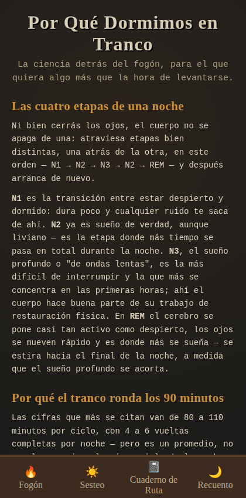

# A la Luz del Fogón

Calculadora de ciclos de sueño: el sueño avanza en bloques de aproximadamente
90 minutos, y despertar al final de un ciclo (en vez de en medio de uno)
reduce la inercia del sueño. La app calcula, a partir de una hora de
despertar o de acostarse, las horas de acostarse/despertar que caen en un
número entero de ciclos — y permite llevar un registro del descanso real a
lo largo del tiempo.

> Rediseño completo (Fases 0 a 9, ver más abajo): de un archivo único con
> estética medieval a una app con build, tests, accesibilidad WCAG AA,
> PWA offline e identidad gauchesca rioplatense (campo argentino,
> ~1800–1900).


## Demo

https://bruneskycoder.github.io/ciclo-de-sueno/

## Correr en local

Requiere Node.js (18+).

```bash
npm install
npm run dev
```

Abre el servidor de desarrollo de Vite (por defecto en `http://localhost:5173`).

Otros comandos disponibles:

```bash
npm run build      # build de producción en dist/
npm run preview    # sirve el build de producción localmente
npm test           # corre los tests (Vitest)
npm run lint        # ESLint
npm run format      # Prettier
```

## Stack

- **Vite** — bundler y dev server. Sin framework de UI (React/Vue/etc.):
  la app no tiene backend ni estado complejo que lo justifique.
- **JavaScript plano, módulos ES** — sin TypeScript.
- **Vitest** — tests unitarios de la lógica de cálculo.
- **CSS plano** — sin framework de utilidades; la app tiene identidad
  visual propia.
- **GitHub Actions** — build y deploy automático a GitHub Pages en cada
  push a `main`.
- Persistencia: `localStorage` (sin backend).

## Estado del rediseño

Este repo viene de una app de un solo archivo (`index.html`, sin
build) que se está refactorizando y ampliando. El trabajo avanza por
fases; cada fase que cambia algo visible se valida antes de seguir a la
siguiente.

- ✅ Fase 0 — Higiene de repo (Vite, ESLint, Vitest, CI/CD)
- ✅ Fase 1 — Identidad visual gauchesca
- ✅ Fase 2 — Refactor técnico y accesibilidad (ARIA, formulario real,
  modal accesible, lógica de cálculo pura y testeada)
- ✅ Fase 3 — Duración de ciclo configurable (70–120 min, persistida)
- ✅ Fase 4 — Modo siesta ("A la Sombra del Ombú")
- ✅ Fase 5 — Métricas de calidad de sueño real
- ✅ Fase 6 — Export/import de datos (backup manual)
- ✅ Fase 7 — PWA real offline (manifest, service worker, íconos)
- ✅ Fase 8 — Página informativa sobre la base científica de los ciclos de sueño
- ✅ Fase 9 — QA y deploy final

## Fuentes consultadas

Los números que usa el modo siesta (Fase 4) no están inventados —
salen de:

- Sleep Foundation, ["Do Power Naps Work?"](https://www.sleepfoundation.org/sleep-hygiene/power-nap) —
  10–30 min como rango de siesta corta (15–20 min ideal), 90 min como
  siesta que completa un ciclo entero, e inercia del sueño explicada
  como el aturdimiento de despertar en una fase profunda.
- Mayo Clinic, ["Napping: Do's and don'ts for healthy adults"](https://www.mayoclinic.org/healthy-lifestyle/adult-health/in-depth/napping/art-20048319) —
  20–30 min como duración ideal, y la relación directa entre siesta
  más larga y más grogui al despertar.

La página informativa de la Fase 8 (ver más abajo) documenta con más
detalle la base científica de los ciclos de sueño en general, con fuentes
adicionales.

## Página informativa (Fase 8)

"Por Qué Dormimos en Tranco" es una vista de referencia sobre la base
científica de los ciclos de sueño: qué son las etapas NREM 1–3 y REM, por
qué el ciclo promedio ronda los 90 minutos (con el rango real de
variación entre 70 y 120 según la persona y la noche), y por qué
despertar en medio del sueño profundo suele producir más inercia del
sueño (el aturdimiento de recién levantado).

Un punto a propósito: la relación entre despertar en sueño profundo (N3)
y peor inercia del sueño —la premisa detrás de esta calculadora— está
bien respaldada pero **no es un hecho cerrado**. Hay estudios que la
confirman y otros que no encuentran la diferencia; el efecto se ve más
que nada después de siestas largas con mucha presión de sueño acumulada.
La página lo dice así, sin vender la premisa de la app como una certeza
que no es.

No forma parte de la navegación inferior a propósito — es contenido para
leer una vez, no una acción de uso diario, así que no le saca lugar a
Fogón/Sesteo/Cuaderno/Recuento. Se llega desde un link en la vista del
Fogón ("¿Por qué 90 minutos?") y se vuelve con un botón dedicado.

Fuentes citadas en el pie de esa vista:

- [NCBI / StatPearls — Physiology, Sleep Stages](https://www.ncbi.nlm.nih.gov/books/NBK526132/)
- [NHLBI (NIH) — Stages of Sleep](https://www.nhlbi.nih.gov/health/sleep/stages-of-sleep)
- [Sleep Foundation — Stages of Sleep](https://www.sleepfoundation.org/stages-of-sleep)
- [Nature and Science of Sleep — Sleep inertia: current insights](https://www.dovepress.com/sleep-inertia-current-insights-peer-reviewed-fulltext-article-NSS) (paper revisado por pares)



## QA final (Fase 9)

Antes de cerrar el rediseño:

- **Tests**: los 64 tests de Vitest (`calc.test.js`, `metrics.test.js`,
  `storage.test.js`) pasan en verde.
- **Lighthouse** (build de producción, servido local): **98 performance
  / 96 accesibilidad / 96 best practices / 100 SEO**. De la primera
  corrida se corrigieron tres cosas reales:
    - el `<meta name="viewport">` traía `user-scalable=no` y
      `maximum-scale=1.0`, que bloqueaban el pinch-to-zoom — mal para
      usuarios con baja visión y en contra del criterio de accesibilidad
      que se viene sosteniendo desde la Fase 2. Se sacó.
    - faltaba un landmark `<main>` — ahora envuelve las 5 vistas.
    - faltaba `<meta name="description">` — se agregó.
    - de paso, se agregaron `rel="preconnect"` a Google Fonts para achicar
      el tiempo de bloqueo de esa hoja de estilos en el render inicial.

    Quedó un aviso de contraste de color en el ítem activo del nav
    (`3.85:1`, el mínimo AA es `4.5:1`) que revisé a mano: el color real
    (`#d99a3f` sobre `#3d2b1f`) da `~5.5:1` calculado con la fórmula de
    WCAG — pasa cómodo. La herramienta lo mide mal porque el
    `text-shadow` (el brillo del texto activo) le contamina el muestreo
    del fondo. No es un problema real, quedó documentado acá en vez de
    "corregido" a ciegas.

- **Mobile real**: no hay un dispositivo físico disponible en este
  entorno de trabajo — ojo con esto, es la limitación más importante de
  esta fase. Lo que sí se hizo, con Playwright emulando iPhone SE,
  iPhone 13, Pixel 5 y un Android angosto (360px): cero desbordes
  horizontales en ninguna de las 5 vistas, el zoom quedó habilitado en
  los cuatro perfiles, y se agrandó el área tocable del link "¿Por qué
  90 minutos?" (pasó de 23px a ~40px de alto). Esto corre sobre motor
  Chromium, no WebKit real — Safari iOS en particular tiene mañas
  propias con el `manifest.json` y el ícono de instalación que esto no
  puede probar. Antes de dar el PWA por 100% validado en iOS, conviene
  que lo abras una vez en un iPhone de verdad y pruebes "Agregar a
  inicio".
- **Deploy end-to-end**: confirmado en dos niveles — `git ls-remote`
  contra GitHub muestra `main` en el commit correcto, y el sitio en vivo
  (`bruneskycoder.github.io`) ya sirve el HTML, el `manifest.json` y el
  `service-worker.js` esperados.

## PWA offline (Fase 7)

La app se puede "instalar" (Agregar a inicio / Install app) y funciona
sin conexión después de la primera visita: `manifest.json` define
nombre, ícono y modo `standalone`, y un service worker
(`public/service-worker.js`) cachea los assets estáticos.

Dos estrategias distintas a propósito: el HTML de navegación va
_network-first_ (si hay red, siempre se sirve la versión más nueva; sin
red, se cae a la última cacheada) para no quedar pegado sirviendo un
HTML viejo que apunta a bundles que ya no existen después de un deploy.
Los bundles JS/CSS (que Vite nombra con un hash de su contenido) van
_cache-first_, porque al tener nombre inmutable no hace falta revalidar
contra la red.

Importante: el service worker recién controla la página a partir de la
**segunda** visita (así funcionan los service workers en general — no
pueden interceptar los pedidos de la carga en la que se instalan a sí
mismos). La primera vez que se abre la app hace falta red; a partir de
la segunda, ya funciona sin conexión.

## Backup manual (Fase 6)

No hay backend — todo vive en el `localStorage` del navegador. Eso
significa que borrar datos del sitio, cambiar de navegador o de
dispositivo, o una reinstalación limpia, se lleva puesto el historial
entero sin previo aviso. En Recuento hay dos botones para esto:

- **Exportar datos**: descarga un JSON (`{version, exportedAt,
cycleLength, records}`) con todo el historial real y la preferencia de
  duración de ciclo. Sirve como backup manual y como forma de pasar el
  historial a otro dispositivo.
- **Importar datos**: lee un JSON con esa misma forma (rechaza con un
  aviso claro cualquier archivo que no matchee, sin tocar nada) y deja
  elegir entre **fusionar** (agrega las noches que falten, sin duplicar
  por id o por fecha, y no toca la configuración actual) o **reemplazar
  todo** (tira el historial actual y lo cambia por el del archivo, y
  también restaura la duración de ciclo guardada en el backup).

## Cambio de esquema en la Fase 5 (rompe compatibilidad con lo guardado antes)

Hasta la Fase 4, el botón "Marcar" de la tabla de resultados del Fogón
guardaba el **cálculo sugerido** (a qué hora convendría acostarse o
despertar) como si fuera una noche dormida. Servía como recordatorio,
pero no como dato real: no había forma de saber si esa noche
efectivamente pasó así.

La Fase 5 separa esto. El Cuaderno de Ruta ahora es un logueo de sueño
**real**: fecha, hora real de acostarse, hora real de despertar, y
opcionalmente una calificación (1-5) y una nota. El botón "Marcar" de la
calculadora desapareció — la calculadora vuelve a ser solo una
calculadora.

Los registros viejos (clave de `localStorage` `sleepLoreDB`) no se leen,
no se escriben ni se borran: quedan intactos pero inactivos en el
navegador de quien ya los tenía. No se migraron al esquema nuevo a
propósito — una sugerencia calculada y una noche real son datos
distintos, y convertir una en la otra habría mezclado ficción con datos
reales en los promedios de la Fase 5. El historial nuevo vive bajo la
clave `sleepLogReal`.

## Licencia

MIT — ver [LICENSE](./LICENSE).
