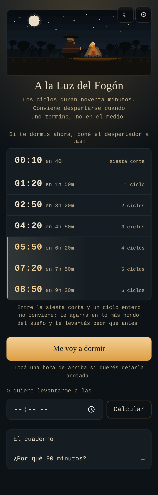
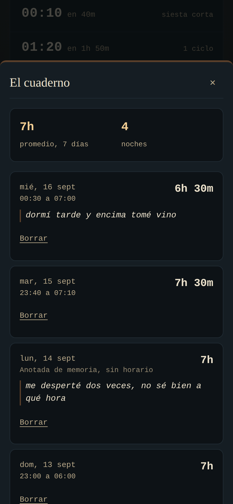
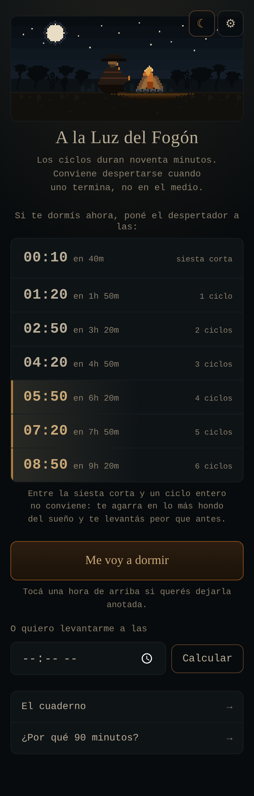
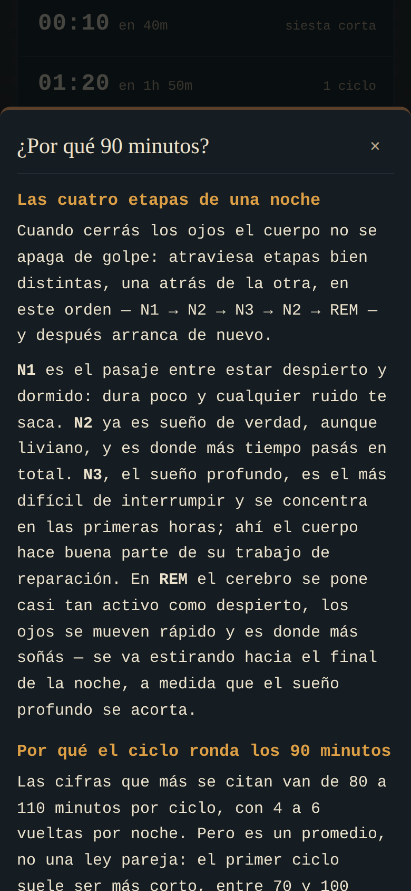
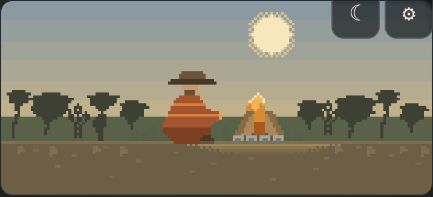

# A la Luz del Fogón

Una calculadora de ciclos de sueño. Le decís a qué hora te querés
levantar, o que te vas a dormir ahora, y te dice a qué hora poner el
despertador para no cortar un ciclo por la mitad.

**[Abrirla →](https://bruneskycoder.github.io/ciclo-de-sueno/)**

Una pantalla, un campo, y la respuesta más frecuente sin tocar nada: al
abrirla ya está calculada.



## Qué hace

**Calcula.** Los ciclos de sueño duran unos noventa minutos y conviene
despertarse cuando uno termina, no en el medio. La app parte de una hora
—la que le digas, o la de ahora mismo— y arma una escalera ordenada de
menos a más: la siesta corta primero, después uno, dos, tres ciclos. Al
lado de cada hora dice cuánto falta, que a la una de la madrugada es el
dato que importa.

**Anota, sin pedírtelo a la mañana.** El registro de sueño de la versión
anterior nunca se usó, y el motivo no era la cantidad de campos: era el
momento. Pedía completar un formulario a la mañana siguiente, y a la
mañana la app no se abre. Ahora, cuando entrás de noche a consultar, una
tarjeta pregunta por anoche: un toque si ya habías marcado que te ibas a
dormir, o cuántas horas dormiste si no. Después, una sola invitación
opcional: una línea sobre la noche.

**Guarda lo que escribís, no lo que calcula.** El cuaderno no es una
planilla. De todo lo que el formulario viejo pedía, lo único que aportaba
una persona era una frase; las horas las saca la app sola. Así que la
frase se lee como una cita y los números quedan de apoyo.



**Se puede mirar a oscuras.** El modo brasa no es un tema alternativo por
gusto: baja la luminancia total y frena el fuego, para cuando la abrís a
las tres de la mañana y no querés la pantalla en la cara. El botón
principal, que es el área de color más grande, pasa de emitir 0.66 de
luminancia relativa a 0.014.



**Dice lo que no sabe.** La premisa de la app —que despertarse al final
de un ciclo reduce la inercia del sueño— tiene buen respaldo pero no es
un hecho cerrado, y la página informativa lo dice con esas palabras, con
las fuentes al pie. Del mismo modo, una noche respondida de memoria se
muestra como _anotada de memoria, sin horario_, y no con un horario
inventado que parezca real.



## Cómo está hecha

Sin framework de UI, sin backend y sin dependencias en tiempo de
ejecución. Vite para el build, Vitest para los tests, CSS plano, y
`localStorage` para los datos.

La lógica vive en módulos **puros, sin DOM y sin `localStorage`**:
`calc.js` (la aritmética de los ciclos), `metrics.js` (los promedios) y
`sleep-session.js` (el estado de la noche en curso). Eso es lo que
permite tener 132 tests que corren en medio segundo sin levantar un
navegador. `storage.js` es la única capa que toca el almacenamiento, y no
importa ninguna vista: avisa que algo cambió y cada vista decide qué
repintar.

La escena de la cabecera es pixel art dibujado con **sprites escritos
como texto en el código**: cada carácter es un píxel y cada letra un
color. Se leen y se editan mirando el archivo, pesan unos cientos de
bytes en vez de un PNG y no agregan un pedido de red. Cambia de paleta
según la hora.



Todo junto son 32 kB de JavaScript, 10,5 comprimido.

Es una PWA: se instala y funciona sin conexión a partir de la segunda
visita. El HTML de navegación va _network-first_ para no quedar sirviendo
una versión vieja después de un deploy; los bundles, que Vite nombra con
un hash de su contenido, van _cache-first_ porque su nombre es inmutable.

## Correrla

Requiere Node 18 o más nuevo.

```bash
npm install
npm run dev        # servidor de desarrollo
npm test           # los 132 tests
npm run lint       # ESLint
npm run build      # build de producción en dist/
npm run preview    # servir el build
```

El deploy a GitHub Pages es automático en cada push a `main`, y corre
lint, tests y build antes de publicar.

## Tus datos

Viven en el `localStorage` de tu navegador y en ningún otro lado. No hay
servidor guardando nada, lo que también significa que borrar los datos
del sitio o cambiar de teléfono se lleva todo. En Ajustes hay export e
import en JSON: es el único respaldo que existe.

## Cómo se construyó

El autor no programa. La app está escrita orquestando un agente de IA, y
lo interesante no es que la IA escribiera el código sino cómo se dirigió:
tres rondas de entrevista antes de planificar, un plan aprobado antes de
tocar nada, y tres veces en que el plan estaba mal y hubo que rehacerlo.

Eso está contado en **[docs/proceso.md](./docs/proceso.md)**, con los
errores incluidos. El plan vivo, con su registro de decisiones y de
desvíos, está en **[PLAN.md](./PLAN.md)**.

## Fuentes

Los números no están inventados. La página informativa cita:

- [NCBI / StatPearls — Physiology, Sleep Stages](https://www.ncbi.nlm.nih.gov/books/NBK526132/)
- [NHLBI (NIH) — Stages of Sleep](https://www.nhlbi.nih.gov/health/sleep/stages-of-sleep)
- [Sleep Foundation — Stages of Sleep](https://www.sleepfoundation.org/stages-of-sleep)
- [Nature and Science of Sleep — Sleep inertia: current insights](https://www.dovepress.com/sleep-inertia-current-insights-peer-reviewed-fulltext-article-NSS)

Y para la siesta, [Sleep Foundation — Do Power Naps
Work?](https://www.sleepfoundation.org/sleep-hygiene/power-nap) y [Mayo
Clinic — Napping: Do's and
don'ts](https://www.mayoclinic.org/healthy-lifestyle/adult-health/in-depth/napping/art-20048319).

## Licencia

MIT — ver [LICENSE](./LICENSE).
