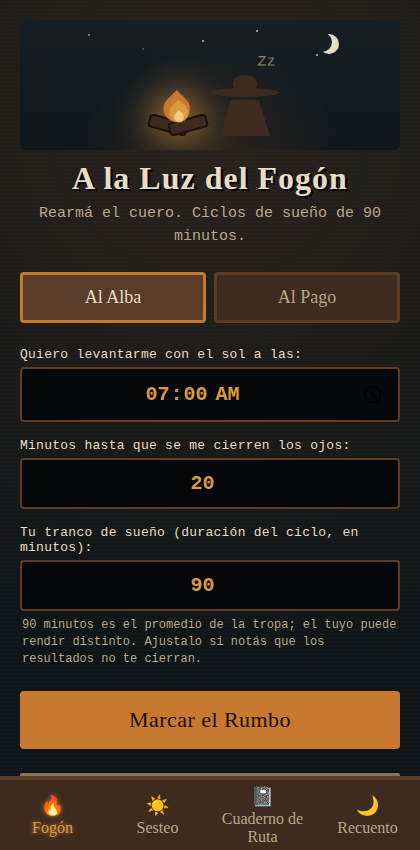

# A la Luz del Fogón

Calculadora de ciclos de sueño: el sueño avanza en bloques de aproximadamente
90 minutos, y despertar al final de un ciclo (en vez de en medio de uno)
reduce la inercia del sueño. La app calcula, a partir de una hora de
despertar o de acostarse, las horas de acostarse/despertar que caen en un
número entero de ciclos — y permite llevar un registro del descanso real a
lo largo del tiempo.

> Proyecto en rediseño activo. La identidad visual (Fase 1 del rediseño)
> ya migró de un concepto medieval a una estética gauchesca rioplatense
> (campo argentino, ~1800–1900) en la vista de la calculadora. Ver el
> estado del rediseño más abajo.



## Demo

https://bruneskycoder.github.io/ciclo-de-sueno/

## Correr en local

Requiere Node.js (18+).

```bash
npm install
npm run dev
```

Abre el servidor de desarrollo de Vite (por defecto en `http://localhost:5173`).

Otros comandos disponibles:

```bash
npm run build      # build de producción en dist/
npm run preview    # sirve el build de producción localmente
npm test           # corre los tests (Vitest)
npm run lint        # ESLint
npm run format      # Prettier
```

## Stack

- **Vite** — bundler y dev server. Sin framework de UI (React/Vue/etc.):
  la app no tiene backend ni estado complejo que lo justifique.
- **JavaScript plano, módulos ES** — sin TypeScript.
- **Vitest** — tests unitarios de la lógica de cálculo.
- **CSS plano** — sin framework de utilidades; la app tiene identidad
  visual propia.
- **GitHub Actions** — build y deploy automático a GitHub Pages en cada
  push a `main`.
- Persistencia: `localStorage` (sin backend).

## Estado del rediseño

Este repo viene de una app de un solo archivo (`index.html`, sin
build) que se está refactorizando y ampliando. El trabajo avanza por
fases; cada fase que cambia algo visible se valida antes de seguir a la
siguiente.

- ✅ Fase 0 — Higiene de repo (Vite, ESLint, Vitest, CI/CD)
- ✅ Fase 1 — Identidad visual gauchesca
- ✅ Fase 2 — Refactor técnico y accesibilidad (ARIA, formulario real,
  modal accesible, lógica de cálculo pura y testeada)
- ✅ Fase 3 — Duración de ciclo configurable (70–120 min, persistida)
- ✅ Fase 4 — Modo siesta ("A la Sombra del Ombú")
- ⏳ Fase 5 — Métricas de calidad de sueño real
- ⏳ Fase 6 — Export/import de datos
- ⏳ Fase 7 — PWA offline
- ⏳ Fase 8 — Página informativa sobre la base científica de los ciclos de sueño
- ⏳ Fase 9 — QA y deploy final

## Fuentes consultadas

Los números que usa el modo siesta (Fase 4) no están inventados —
salen de:

- Sleep Foundation, ["Do Power Naps Work?"](https://www.sleepfoundation.org/sleep-hygiene/power-nap) —
  10–30 min como rango de siesta corta (15–20 min ideal), 90 min como
  siesta que completa un ciclo entero, e inercia del sueño explicada
  como el aturdimiento de despertar en una fase profunda.
- Mayo Clinic, ["Napping: Do's and don'ts for healthy adults"](https://www.mayoclinic.org/healthy-lifestyle/adult-health/in-depth/napping/art-20048319) —
  20–30 min como duración ideal, y la relación directa entre siesta
  más larga y más grogui al despertar.

La Fase 8 (página informativa) va a documentar con más detalle la base
científica de los ciclos de sueño en general, con las mismas fuentes
primarias.

## Licencia

MIT — ver [LICENSE](./LICENSE).
